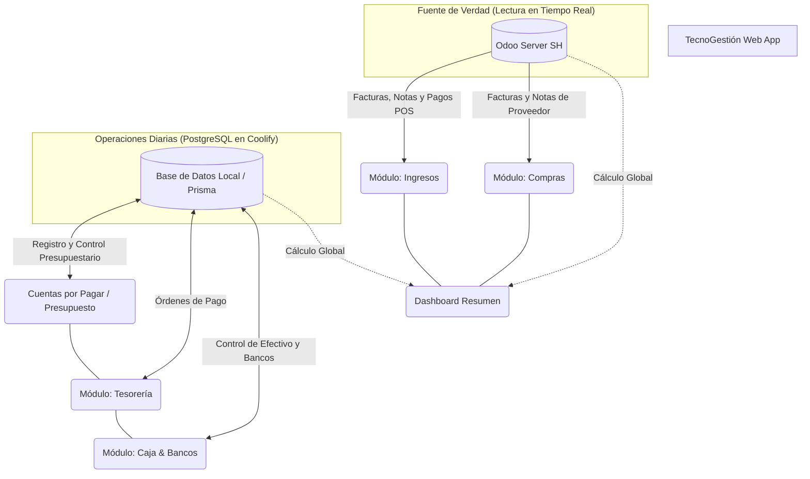

# Mapa Conceptual de TecnoGestión (Actualizado)

Este documento refleja cómo la aplicación está estructurada lógicamente, dividiendo las responsabilidades entre **Odoo** (nuestra fuente de la verdad para la facturación/compras principales) y la **Base de Datos Local Postgres (Prisma)** (nuestro motor para el presupuesto, órdenes de pago y operaciones diarias).

## Arquitectura General

---

## Detalle por Módulos

### 1. Dashboard (Resumen General)
Es el centro de mando. Recolecta indicadores de salud de la empresa con los siguientes renglones específicos:
* **VENTAS:** Ingresos (Bs y $), CxC (método de pago que contenga "crédito"), e Impuestos.
* **COMPRAS:** Mercancías y 25% Pago de IVA.
* **GASTOS:** Nómina, Servicios y Gastos Operativos.
* **MOVIMIENTOS:** Bancos (Bs y $) y Cajas (Bs y $).

### 2. Ingresos (Ventas)
* **Origen:** 100% Odoo.
* **Lógica:** Extrae registros del POS y facturas. Separa operaciones **Fiscales** (Base + IVA) de operaciones **No Fiscales** (Notas de Entrega).

### 3. Compras (Inventario)
* **Origen:** 100% Odoo.
* **Lógica:** Extrae compras. Separa documentos Fiscales de No Fiscales.

### 4. Cuentas por Cobrar (CxC)
* **Lógica:** Extrae directamente de Odoo (POS) basándose en los métodos de pago que contengan la palabra "crédito". Todo lo registrado bajo estos métodos de pago es considerado una CxC (por ejemplo, pagos vía Cashea).

### 5. Caja & Bancos
* **Origen:** PostgreSQL (Local).
* **Lógica:** Arranca con saldos iniciales (separados en **Bs y Dólares**) tanto para cajas físicas como para cuentas bancarias. Se alimenta de las operaciones diarias (ingresos/egresos) generando un saldo final.

### 6. Gastos CXP
* **Origen:** Híbrido (Odoo / Local).
* **Lógica:** Esta sección unifica Gastos y Cuentas por Pagar. Su función es **crear en Odoo** los gastos según el tipo de documento: Factura (fiscal, con nro. de factura y control, BI, imp) o Nota (no fiscal, con o sin referencia). Utilizará un concepto o producto no facturable/comprable sin inventario en Odoo.

### 7. Tesorería
* **Origen:** PostgreSQL (Local).
* **Lógica:** Se alimenta de las operaciones generadas en *Gastos CXP*. Su objetivo principal es ordenar y preparar los pagos para su posterior aprobación y ejecución.

### 8. Roles y Permisología
* **Origen:** PostgreSQL (Local).
* **Lógica:** Administración de usuarios, contraseñas, y niveles de acceso a los diferentes módulos de la aplicación.
