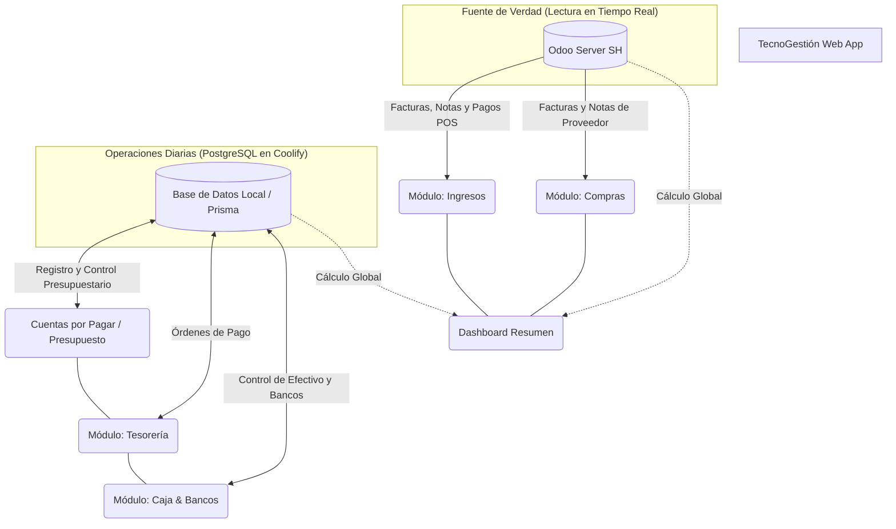

# Mapa Conceptual de TecnoGestión (Actualizado)

Este documento refleja cómo la aplicación está estructurada lógicamente, dividiendo las responsabilidades entre **Odoo** (nuestra fuente de la verdad para la facturación/compras principales) y la **Base de Datos Local Postgres (Prisma)** (nuestro motor para el presupuesto, órdenes de pago y operaciones diarias).

## Arquitectura General

---

## Detalle por Módulos

### 1. Dashboard (Resumen General)
Es el centro de mando. Recolecta indicadores de salud de la empresa.
* **Lee de Odoo:** Ingresos y Compras.
* **Lee de Postgres (Local):** Gastos reales vs Presupuesto, y saldo de bancos/cajas.

### 2. Ingresos (Ventas)
* **Origen:** 100% Odoo.
* **Lógica:** Extrae registros del POS y facturas. Separa operaciones **Fiscales** (Base + IVA) de operaciones **No Fiscales** (Notas de Entrega).

### 3. Compras (Inventario y Cuentas por Pagar Odoo)
* **Origen:** 100% Odoo.
* **Lógica:** Extrae compras. **Al igual que en ventas**, debe separar documentos Fiscales de No Fiscales.

### 4. Cuentas por Cobrar (CxC)
* **Lógica:** Controla la deuda de clientes hacia la empresa, **e incluye críticamente a Cashea**, ya que las ventas pagadas por este medio se convierten en un crédito que la empresa Cashea le debe a TecnoGestión.

### 5. Caja & Bancos (Sustituye a Caja Admin)
* **Origen:** PostgreSQL (Local).
* **Lógica:** Arranca con saldos iniciales (separados en **Bs y Dólares**) tanto para cajas físicas como para cuentas bancarias. Se alimenta de las operaciones diarias (ingresos/egresos) generando un saldo final.

### 6. Cuentas por Pagar (CxP) y Presupuesto
* **Origen:** PostgreSQL (Local).
* **Lógica:** Ya que Odoo no lleva esto de la manera que la empresa necesita, este módulo local sirve para crear el **presupuesto mensual** de gastos operativos y administrativos que gestiona la empresa.

### 7. Tesorería
* **Origen:** PostgreSQL (Local).
* **Lógica:** Se encarga de controlar las obligaciones generadas en la CxP local y ejecutar las **Órdenes de Pago**, afectando finalmente los saldos en el módulo de *Caja & Bancos*.

### 8. Gastos
* **Origen:** PostgreSQL (Local).
* **Lógica:** Gestión detallada de gastos manuales que no necesariamente provienen de las compras de Odoo, y se asocian a las cuentas del presupuesto.

### 9. Roles y Permisología
* **Origen:** PostgreSQL (Local).
* **Lógica:** Administración de usuarios, contraseñas, y niveles de acceso a los diferentes módulos de la aplicación.
